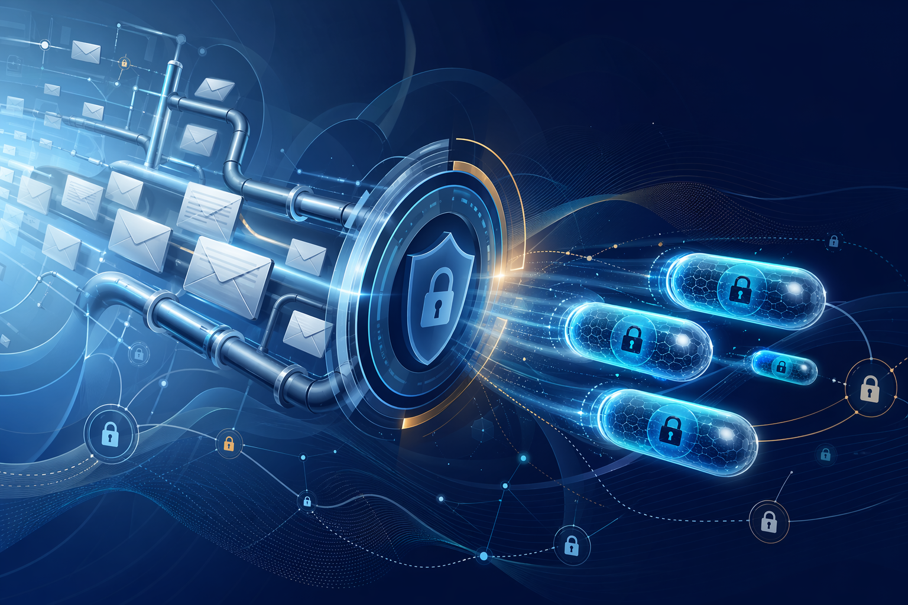

# Mimicrypt

<p align="center">
  
</p>

<p align="center">
  <strong>Шифрованный messenger поверх обычной email-инфраструктуры.</strong><br />
  Rust secure core, Tauri shell, desktop + mobile direction, локальный state, crypto-first архитектура.
</p>

<p align="center">
  
  
  
  
</p>

## Что Это Вообще Такое

**Mimicrypt** это концепт приватного мессенджера, который мимикрирует под обычную email-доставку, но внутри работает как отдельный encrypted transport layer.

Идея простая:

- снаружи это выглядит как совместимость с привычной почтовой инфраструктурой;
- внутри это `E2EE`, ratchet-сессии, prekeys, envelope-слой и локальная защищённая модель состояния;
- сверху на всём этом сидит нормальный продуктовый shell, а не просто набор криптобиблиотек.

Проект делается не как сухая криптографическая демка, а как штука с настоящим продуктовым вайбом: onboarding, контакты, invite flow, локальное хранение, desktop shell, mobile packaging.

## Почему Проект Выглядит Сильно

- `Rust workspace` разделён по ролям: типы, крипта, bootstrap, ratchet, envelope, transport, storage, reliability.
- `Tauri shell` даёт путь к desktop и mobile из одного продуктового контура.
- `React/Vite UI` уже оформлен как живое приложение, а не как заглушка.
- `SQLite + keyring direction` делают локальный state реалистичным.
- `GitHub Actions` уже готовы для desktop и mobile build-потока.

## Ключевая Идея

> Не строить ещё один чат с нуля по всей сети, а завернуть приватную коммуникацию в уже существующий email-канал так, чтобы пользователь видел продукт, а не внутреннюю криптографическую кухню.

<p align="center">
  
</p>

## Что Уже Есть

### Secure Core

- wire types и protocol invariants в `crates/spec-types`
- `Ed25519`, `X25519`, `HKDF-SHA256`, `ChaCha20-Poly1305`
- signed prekeys, one-time prekeys, invite/bootstrap flow
- TOFU pinning и fingerprint logic
- Signal-style ratchet wrapper
- padded plaintext envelope + binary encoding + transport-safe representation

### Transport + Reliability

- SMTP send / IMAP receive direction
- UID-based queue model
- retry/backoff слой
- receipt / dedupe / inbound tracking foundation
- локальное durable state storage

### Product Shell

- desktop Tauri app shell
- React onboarding and messenger-style flow
- local-first persistence
- export/import direction
- подготовленная база под Android и iPhone packaging

## Структура Репозитория

| Путь | Назначение |
| --- | --- |
| `crates/spec-types` | общие wire types и protocol contracts |
| `crates/crypto` | ключи, подписи, AEAD, fingerprint helpers |
| `crates/bootstrap` | invite flow, prekeys, trust bootstrap |
| `crates/ratchet` | ratchet session wrapper и replay guards |
| `crates/envelope` | canonicalization, padding, AAD, encrypted envelope |
| `crates/mail-transport` | SMTP/IMAP transport layer |
| `crates/reliability` | queue, retry, receipt, dedupe logic |
| `crates/storage` | durable local state и export scaffolding |
| `crates/app-services` | orchestration layer для app shell |
| `apps/desktop-tauri` | Tauri + React product shell |
| `docs/protocol/spec.md` | protocol draft |
| `scripts/*` | bootstrap и mobile tooling |

## Быстрый Старт

### Проверить Rust core

```bash
. "$HOME/.cargo/env"
cargo test
```

### Поднять product shell

```bash
cd apps/desktop-tauri
npm install
npm run dev
```

Потом открыть `http://127.0.0.1:4173`.

### Собрать frontend

```bash
cd apps/desktop-tauri
npm run build
```

## Платформы

Проект уже ориентирован на единый кодовый контур для:

- macOS
- Windows
- Android
- iPhone

### Desktop build

```bash
cd apps/desktop-tauri
npm install
npm run tauri:build
```

### Mobile bootstrap

```bash
zsh scripts/prepare-mobile-macos.sh

cd apps/desktop-tauri
npm install
npm run mobile:bootstrap
```

### Android

```bash
cd apps/desktop-tauri
npm install
npm run android:init
npm run android:build
```

### iPhone

```bash
cd apps/desktop-tauri
npm install
npm run ios:init
npm run ios:build
```

## CI И Релизный Поток

- desktop pipeline: `.github/workflows/desktop-release.yml`
- mobile pipeline: `.github/workflows/mobile-build.yml`

Ожидаемые artifact targets:

- macOS `.app` / `.dmg`
- Windows `nsis` / `msi`
- Android `apk` / `aab`
- iOS app shell и Xcode-oriented build flow

## Текущий Статус

Сейчас это уже не просто идея на словах:

- core crates настоящие и тестируются;
- desktop shell поднимается и собирается;
- mobile direction физически разложен по проекту;
- storage, crypto и protocol части уже оформлены как нормальная инженерная система;
- до полного end-to-end production flow ещё нужен полноценный wiring живых mailbox-операций в app shell.

## Почему Это Может Зацепить

Потому что это смесь трёх жанров сразу:

- криптографический pet-project;
- продуктовый интерфейсный концепт;
- инженерная попытка сделать email не унылым, а странно-опасно-интересным.

## Disclaimer

**Да, внизу самое важное:** это чистый фан и прикол.

Проект выглядит серьёзно, архитектурно собран и технически амбициозен, но сам замысел здесь во многом про удовольствие от сборки необычного encrypted product concept поверх старой инфраструктуры.
